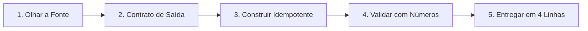

# 🛡️ bulletproof-data — Antigravity & AI Agent Skill

> **Because data fails in silence: runs without errors, delivers the wrong numbers.**
> *Método rigoroso de Engenharia de Dados defensiva para agentes de IA (Antigravity / Gemini Code Assist / Claude Code).*

[](https://github.com)
[](LICENSE)
[](#)
[](#)

---

## 🎯 Por que usar a skill `bulletproof-data`?

Quando você pede para um modelo de IA escrever um SQL ou montar um pipeline, o padrão é ele gerar queries que funcionam sintaticamente, mas que **falham em silêncio em produção**:
- Faz `LEFT JOIN` com filtro no `WHERE` e transforma em `INNER JOIN` sem perceber.
- Cria `INSERT` cego que duplica registros no dia seguinte.
- Usa `CAST` implícito no `ON` que desativa poda de partição e gera *full scan* caríssimo.
- Ignora *data skew* em chaves com muitos nulos que travam 99% da execução num único worker.
- Não testa se a contagem pós-join bateu com a tabela base (*fan-out invisível*).
- Apaga dados silenciosamente ao fazer `UNNEST` padrão em arrays vazios.

A skill **`bulletproof-data`** ensina o agente a agir como um **Staff Data Engineer**: econômico nas palavras, rigoroso com números e focado em idempotência, validação, grão e integridade.

---

## 🚀 Instalação Rápida

### Opção 1: Instalação Global (Disponível em qualquer projeto do seu computador)

#### No Windows (PowerShell):
```powershell
irm https://raw.githubusercontent.com/<seu-usuario>/bulletproof-data/main/install.ps1 | iex
```
*(Ou clone este repositório e execute `./install.ps1` no PowerShell)*

#### No Linux / macOS (Bash):
```bash
curl -fsSL https://raw.githubusercontent.com/<seu-usuario>/bulletproof-data/main/install.sh | bash
```
*(Ou clone este repositório e execute `./install.sh` no terminal)*

A skill será instalada automaticamente em `~/.gemini/config/skills/bulletproof-data/`.

---

### Opção 2: Instalação por Projeto (Compartilhada no Git com o seu Time)

Para incluir a skill diretamente no repositório de dados da sua empresa ou projeto:

1. Na raiz do seu repositório, crie a pasta `.agents/skills/`:
```bash
mkdir -p .agents/skills
```
2. Copie a pasta `bulletproof-data` deste repositório para `.agents/skills/bulletproof-data/`.
3. Faça o commit no Git. Qualquer desenvolvedor ou agente trabalhando nesse repositório usará automaticamente as mesmas regras de engenharia de dados!

---

## 📋 Como o Agente Opera

A skill é estruturada em **5 passos obrigatórios** definidos em [SKILL.md](bulletproof-data/SKILL.md):



1. **Olhar a fonte antes de codar**: grão, chave única real (`COUNT` vs `COUNT DISTINCT`), fuso e nulos disfarçados (`""`, `"NULL"`, `1970-01-01`).
2. **Contrato de saída**: grão + chave declarados em 1–2 frases antes do código.
3. **Construir para rodar duas vezes (Idempotência)**: `MERGE`/upsert ou overwrite de partição; watermark pelo `MAX(updated_at)` gravado; dedup *antes* do filtro de status.
4. **Validar antes de dizer pronto**: contagem fonte vs saída, soma da métrica principal, buraco de dia e 5 linhas no olho. *"Funcionou sem erro" não é validação.*
5. **Entregar**: o que fez, onde está, como rodar de novo e o que quebra.

---

## 📚 Referências Especializadas

A skill inclui módulos de aprofundamento carregados sob demanda pelo agente:

| Referência | Foco | O que cobre |
| :--- | :--- | :--- |
| **[`modelagem-sql.md`](bulletproof-data/references/modelagem-sql.md)** | Modelagem & SQL | Camadas (*raw/staging/mart*), nomenclatura, grão/fan-out, data skew em join, cast implícito, tratamento de JSON/semi-estruturado (`UNNEST`), SCD e checklist de revisão de SQL. |
| **[`qualidade.md`](bulletproof-data/references/qualidade.md)** | Qualidade de Dados | 6 dimensões (completude, unicidade, consistência, etc.), queries da bateria mínima, método de isolamento de conciliação ("não bate") e detecção de *schema drift*. |
| **[`triagem.md`](bulletproof-data/references/triagem.md)** | Triagem de Falhas | Diagnóstico de pipeline quebrado (*Parou, Duplicou, Faltou, Errado, Atrasou*), reprocessamento seguro sem duplicação e relatório de causa raiz (RCA) em 4 linhas. |

---

## 💬 Exemplos de Prompts que Ativam a Skill

Quando a skill estiver instalada, o agente a ativará automaticamente quando você fizer perguntas como:

- *"Revisa esse SQL aqui, quero saber se tem risco de fan-out, cast implícito ou custo alto."*
- *"O relatório financeiro de ontem não bate com o banco de produção por R$ 5.000. Como isolamos a diferença?"*
- *"Preciso fazer uma carga incremental diária de uma API de pedidos para a camada Silver com idempotência."*
- *"O job do Airflow demorou 6 horas hoje e antes levava 20 minutos. O que investigar?"*
- *"Modela uma tabela fato de pagamentos a partir desses eventos brutos em JSON."*

---

## 🤝 Contribuindo

Contribuições da comunidade são muito bem-vindas!
- Encontrou uma armadilha comum de BigQuery, Snowflake, Databricks, PostgreSQL ou dbt que não está mapeada?
- Tem um caso de borda de conciliação ou skew para adicionar?

Abra uma **Issue** ou envie um **Pull Request**.

---

## 📄 Licença

Distribuído sob a licença [MIT](LICENSE). Uso livre para projetos pessoais, open-source e comerciais.
